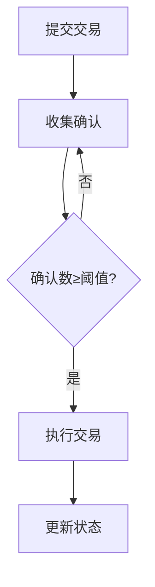

Dapp实战案例003：从零部署 2/3 多签钱包并实现前端交互

本教程将带你学习如何构建一个需要3个签名者中2人确认才能执行的智能合约钱包，涵盖以下核心内容：
- 多签钱包原理与安全机制
- Hardhat本地开发环境配置
- TypeScript智能合约开发
- Vite前端交互实现
- 钱包权限管理最佳实践

---

## 目录
1. [环境准备](#一、环境准备)
2. [开发思路](#二、开发思路)
3. [合约开发](#三、合约开发)
4. [本地测试](#四、本地测试)
5. [前端开发](#五、前端开发)
6. [部署上线](#六、部署上线)
7. [安全规范](#七、安全规范)

---


## 一、环境准备

### 1.1 开发环境搭建
```bash
# 创建项目目录
mkdir multi-sig-wallet && cd multi-sig-wallet

# 初始化Hardhat
npm init -y
npm install --save-dev hardhat @nomicfoundation/hardhat-toolbox
npx hardhat init

# 选择 "Create a basic sample project"

# 安装依赖
npm install -D dotenv
npm install @openzeppelin/contracts

1.2 网络配置
创建 .env 文件：

首先需要注册 Infura 账号获取 API Key。Infura 是以太坊的基础设施提供商,为开发者提供节点访问服务。

访问 [Infura官网](https://www.infura.io/) 注册账号并创建新项目,获取项目ID(即API Key)。

创建 .env 文件，配置Infura API Key和钱包私钥：
INFURA_KEY=your_infura_key
PRIVATE_KEY=your_private_key

配置 hardhat.config.ts：

```typescript
import { HardhatUserConfig } from "hardhat/config";
import { ethers } from "hardhat";

require("@nomicfoundation/hardhat-toolbox");
require("dotenv").config();

const config: HardhatUserConfig = {
  solidity: "0.8.20",
  networks: {
    sepolia: {
      url: `https://sepolia.infura.io/v3/${process.env.INFURA_KEY}`,
      accounts: [process.env.PRIVATE_KEY!]
    }
  },
  etherscan: {
    apiKey: process.env.ETHERSCAN_API_KEY
  }
};

export default config;
```


## 二、开发思路

本多签钱包合约采用分层架构设计，主要包含以下核心组件：

1. **所有者管理模块**
   - 初始化时设置所有者地址列表和确认阈值
   - 通过`onlyOwner`修饰器实现权限控制
   - 使用映射结构高效验证所有者身份

2. **交易生命周期管理**
   - 提交交易：生成唯一交易ID并记录交易详情
   - 确认交易：收集所有者签名，达到阈值后即可执行
   - 执行交易：通过底层call方法完成资金转移

3. **状态追踪机制**
   - 使用`nonce`防止重放攻击
   - 通过`executed`标记防止重复执行
   - 实时更新确认状态映射

### 安全考虑

1. **权限控制**
   - 所有关键操作都限制为仅所有者可调用
   - 构造函数验证所有者地址唯一性
   - 交易执行前验证确认数是否达标

2. **输入验证**
   - 检查目标地址不为零地址
   - 验证交易ID有效性
   - 防止重复确认

3. **防御机制**
   - 使用require语句进行前置条件检查
   - 交易执行后验证call操作结果
   - 通过事件日志追踪所有关键操作

### 执行流程



---

## 三、合约开发
3.1 核心合约代码
// contracts/MultiSigWallet.sol
// SPDX-License-Identifier: MIT
pragma solidity ^0.8.0;

import "@openzeppelin/contracts/access/AccessControl.sol";

/**
 * @title 多签钱包合约
 * @notice 基于OpenZeppelin的AccessControl实现的多签钱包，需要达到指定阈值确认才能执行交易
 */
contract MultiSigWallet is AccessControl {
    /// @notice 提案者角色，拥有提交交易的权限
    bytes32 public constant PROPOSER_ROLE = keccak256("PROPOSER_ROLE");
    
    /// @notice 执行者角色，拥有执行交易的权限
    bytes32 public constant EXECUTOR_ROLE = keccak256("EXECUTOR_ROLE");

    /**
     * @dev 交易数据结构
     * @param to 目标地址
     * @param value 转账金额(wei)
     * @param data 调用数据
     * @param executed 是否已执行
     * @param confirmations 当前确认数
     */
    struct Transaction {
        address to;
        uint256 value;
        bytes data;
        bool executed;
        uint256 confirmations;
    }

    uint256 public threshold;
    uint256 public nonce;
    mapping(uint256 => Transaction) public transactions;
    mapping(uint256 => mapping(address => bool)) public confirmations;

    event ProposalCreated(
        uint256 proposalId,
        address proposer,
        address to,
        uint256 value,
        bytes data
    );
    
    event Confirmed(uint256 proposalId, address confirmator);
    event Executed(uint256 proposalId);

    modifier onlyProposer() {
        require(hasRole(PROPOSER_ROLE, msg.sender), "Not a proposer");
        _;
    }

    modifier notExecuted(uint256 proposalId) {
        require(!transactions[proposalId].executed, "Already executed");
        _;
    }

    /**
     * @dev 构造函数，初始化多签钱包
     * @param _owners 所有者地址数组
     * @param _threshold 执行交易所需的最小确认数
     * @notice 每个所有者将被授予DEFAULT_ADMIN_ROLE和PROPOSER_ROLE
     */
    constructor(address[] memory _owners, uint256 _threshold) {
        require(_owners.length >= _threshold, "Invalid threshold");
        require(_threshold > 0, "Threshold must be > 0");
        
        threshold = _threshold;
        nonce = 0;

        // 权限修改需要通过多签流程
        // _grantRole(DEFAULT_ADMIN_ROLE, multiSigAdminAddress);
        for (uint256 i = 0; i < _owners.length; i++) {
            _grantRole(PROPOSER_ROLE, _owners[i]);
            _grantRole(EXECUTOR_ROLE, _owners[i]); // 新增这行
        }
    }

    /**
     * @dev 提交新交易提案
     * @param _to 目标地址
     * @param _value 转账金额(wei)
     * @param _data 调用数据
     * @notice 只有PROPOSER_ROLE可以调用
     * @notice 自动递增nonce作为提案ID
     */
    function submitTransaction(
        address _to,
        uint256 _value,
        bytes calldata _data
    ) external onlyProposer notExecuted(nonce) {
        transactions[nonce] = Transaction({
            to: _to,
            value: _value,
            data: _data,
            executed: false,
            confirmations: 0
        });
        
        emit ProposalCreated(nonce, msg.sender, _to, _value, _data);
        nonce++;
    }

    /**
     * @dev 确认交易提案
     * @param _proposalId 提案ID
     * @notice 只有DEFAULT_ADMIN_ROLE可以调用
     * @notice 每个地址只能确认一次
     * @notice 增加提案的确认计数
     */
    function confirmTransaction(uint256 _proposalId) 
        external 
        notExecuted(_proposalId)
    {
        require(!confirmations[_proposalId][msg.sender], "Already confirmed");
        require(hasRole(PROPOSER_ROLE, msg.sender), "Not authorized");
        
        confirmations[_proposalId][msg.sender] = true;
        transactions[_proposalId].confirmations++;

        emit Confirmed(_proposalId, msg.sender);
    }

    /**
     * @dev 执行交易提案
     * @param _proposalId 提案ID
     * @notice 需要达到阈值确认数才能执行
     * @notice 执行后标记为已执行状态
     * @notice 如果执行失败会回滚
     */
    function executeTransaction(uint256 _proposalId)
        external
        notExecuted(_proposalId)
    {
        require(hasRole(EXECUTOR_ROLE, msg.sender), "Not an executor");
        Transaction storage transaction = transactions[_proposalId];
        require(
            transaction.confirmations >= threshold,
            "Insufficient confirmations"
        );

        transaction.executed = true;
        (bool success, ) = transaction.to.call{value: transaction.value}(
            transaction.data
        );
        require(success, "Transaction failed");

        emit Executed(_proposalId);
    }

    /**
     * @dev 获取当前交易提案总数
     * @return 交易提案总数
     */
    function getTransactionCount() external view returns (uint256) {
        return nonce;
    }

    /**
     * @dev 允许合约接收以太币
     */
    receive() external payable {}

    /**
     * @dev 允许合约通过fallback接收以太币
     */
    fallback() external payable {}
}

## 四、本地测试
4.1 测试脚本
// 导入必要的依赖
import { expect } from "chai";
import { ethers } from "hardhat";
import type { SignerWithAddress } from "@nomicfoundation/hardhat-ethers/signers";
import type { MultiSigWallet } from "../typechain-types";

describe("MultiSigWallet", function () {
  // 定义测试需要的变量
  let owner1: SignerWithAddress;
  let owner2: SignerWithAddress;
  let owner3: SignerWithAddress;
  let nonOwner: SignerWithAddress;
  let owners: SignerWithAddress[];
  let multiSigWallet: MultiSigWallet;

  // 在所有测试开始前执行一次
  before(async function () {
    // 获取测试账号
    [owner1, owner2, owner3, nonOwner] = await ethers.getSigners();
    // 设置多签钱包的所有者
    owners = [owner1, owner2, owner3];
  });

  // 每个测试用例执行前都会执行
  beforeEach(async function () {
    // 部署多签钱包合约，设置所有者和确认门槛为2
    const MultiSigWalletFactory = await ethers.getContractFactory("MultiSigWallet");
    multiSigWallet = await MultiSigWalletFactory.deploy(owners.map(o => o.address), 2);
    await multiSigWallet.waitForDeployment();
  });

  // 测试提交交易功能
  it("Should submit a transaction", async function () {
    await expect(
      multiSigWallet.connect(owners[0]).submitTransaction(
        owners[1].address,
        ethers.parseEther("1.0"),
        "0x"
      )
    ).to.emit(multiSigWallet, "ProposalCreated");
  });

  // 测试具有足够确认数的交易执行
  it("Should execute transaction with enough confirmations", async function () {
    // 1. 给合约充值 1 ETH
    await owners[0].sendTransaction({
      to: await multiSigWallet.getAddress(),
      value: ethers.parseEther("1.0")
    });

    // 2. owner1 提交交易，目标为 nonOwner，金额 1 ETH，data 为 "0x"
    await multiSigWallet.connect(owners[0]).submitTransaction(
      nonOwner.address,
      ethers.parseEther("1.0"),
      "0x"
    );

    // 3. owner1 和 owner2 分别确认
    await multiSigWallet.connect(owners[0]).confirmTransaction(0);
    await multiSigWallet.connect(owners[1]).confirmTransaction(0);

    // 打印当前交易的确认次数
    const tx = await multiSigWallet.transactions(0);
    console.log("Current confirmations:", tx.confirmations.toString());
    // 4. owner3 执行交易，验证 nonOwner 收到 1 ETH
    await expect(
      multiSigWallet.connect(owners[2]).executeTransaction(0)
    ).to.changeEtherBalance(nonOwner, ethers.parseEther("1.0"));
  });

  // 测试确认数不足时交易执行失败
  it("Should revert if insufficient confirmations", async function () {
    // 1. 给合约充值 1 ETH
    await owners[0].sendTransaction({
      to: await multiSigWallet.getAddress(),
      value: ethers.parseEther("1.0")
    });

    // 2. owner1 提交交易，目标为 nonOwner，金额 1 ETH，data 为 "0x"
    await multiSigWallet.connect(owners[0]).submitTransaction(
      nonOwner.address,
      ethers.parseEther("1.0"),
      "0x"
    );

    // 3. 只确认一次（不足阈值2）
    await multiSigWallet.connect(owners[0]).confirmTransaction(0);

    // 4. nonOwner 尝试执行交易，应该 revert
    await expect(
      multiSigWallet.connect(owners[2]).executeTransaction(0)
    ).to.be.revertedWith("Insufficient confirmations");
  });
});


## 五、前端开发

### 5.1 前端依赖与集成说明

本项目前端基于 React + TypeScript，集成了 RainbowKit、Wagmi 和 React Query 等现代 Web3 技术栈，便于实现钱包连接、链上交互和数据状态管理。

- **RainbowKit**：提供优雅的 Web3 钱包连接 UI 组件，支持多种主流钱包。
- **Wagmi**：以太坊 React Hooks 库，简化链上交互和账户管理。
- **TanStack Query**：高效的数据请求与缓存管理，提升前端响应速度和用户体验。

#### 5.2 依赖安装

```bash
npm create vite@latest frontend -- --template react-ts
cd frontend
npm install viem wagmi @tanstack/react-query @rainbow-me/rainbowkit
```

#### 5.3 前端入口文件配置（main.tsx）

main.tsx 作为前端应用的入口，负责初始化 Wagmi、RainbowKit、React Query，并包裹整个 App 组件。核心结构如下：

```tsx
import { StrictMode } from 'react'
import { createRoot } from 'react-dom/client'
import './index.css'
import App from './App.tsx'

// 导入RainbowKit相关依赖 - Web3钱包连接UI组件库
import { getDefaultConfig, RainbowKitProvider } from '@rainbow-me/rainbowkit'

// 导入Wagmi相关依赖 - 以太坊React Hooks库
import { WagmiProvider } from 'wagmi'

// 导入支持的区块链网络
import { mainnet, polygon, optimism, arbitrum, base, sepolia } from 'wagmi/chains'

// 导入React Query相关依赖 - 数据请求状态管理
import { QueryClient, QueryClientProvider } from '@tanstack/react-query'

// 配置Wagmi客户端
const config = getDefaultConfig({
  appName: 'MultiSigWallet app', // 应用名称
  projectId: 'YOUR_PROJECT_ID',   // WalletConnect项目ID
  chains: [mainnet, polygon, optimism, arbitrum, base, sepolia], // 支持的链
})

// 创建React Query客户端实例
const queryClient = new QueryClient()

// 渲染React应用
createRoot(document.getElementById('root')!).render(
  <StrictMode>
    {/* Wagmi提供者 - 处理web3状态 */}
    <WagmiProvider config={config}>
      {/* React Query提供者 - 处理数据请求状态 */}
      <QueryClientProvider client={queryClient}>
        {/* RainbowKit提供者 - 提供钱包连接UI */}
        <RainbowKitProvider>
          <App />
        </RainbowKitProvider>
      </QueryClientProvider>
    </WagmiProvider>
  </StrictMode>,
)
```

### 5.4 本地网络配置（Hardhat）

1. 环境变量配置（新建`.env.local`文件）：
```ini
VITE_PUBLIC_HARDHAT_RPC="http://localhost:8545"
VITE_PUBLIC_CONTRACT_ADDRESS="0x5FbDB2315678afecb367f032d93F642f64180aa3"
```

> 请将 `YOUR_PROJECT_ID` 替换为你在 WalletConnect 平台申请的实际项目ID。

这样配置后，App 组件及其子组件即可在全局范围内访问 Web3 钱包连接、链上交互和数据请求能力。

---

4.3 钱包交互界面
// src/components/WalletUI.tsx
import { useState } from 'react';
import { ethers } from 'ethers';

export default function WalletUI() {
  const [transactions, setTransactions] = useState([]);
  const [newTx, setNewTx] = useState({ to: '', value: '' });

  // 提交交易处理流程
const submitTransaction = async () => {
    // 前置条件检查
    if (!walletAddress || !provider) return;
    
    try {
      const signer = provider.getSigner();
      const contract = new ethers.Contract(contractAddress, contractABI, signer);
      
      const tx = await contract.submitTransaction(
        newTx.to,
        ethers.parseEther(newTx.value),
        '0x'
      );
      await tx.wait();
      
      // 刷新交易列表
      fetchTransactions();
    } catch (error) {
      console.error("提交失败:", error);
    }
  };

  return (
    <div>
      <h2>发起新交易</h2>
      <input 
        placeholder="目标地址"
        value={newTx.to}
        onChange={(e) => setNewTx({...newTx, to: e.target.value})}
      />
      <input 
        type="number"
        placeholder="金额 (ETH)"
        value={newTx.value}
        onChange={(e) => setNewTx({...newTx, value: e.target.value})}
      />
      <button onClick={submitTransaction}>提交</button>

      <h2>交易记录</h2>
      <ul>
        {transactions.map((tx) => (
          <li key={tx.id}>
            {tx.to} - {tx.value} ETH - {tx.status}
          </li>
        ))}
      </ul>
    </div>
  );
}

4.4 注意事项
如果nonce没有显示可能需要清理缓存
```bash
# 清理编译缓存
npx hardhat clean

# 重新编译合约
npx hardhat compile

# 启动节点
npx hardhat node

# 新终端部署合约
npx hardhat run scripts/deploy.ts --network localhost
```

五、部署上线
5.1 部署脚本
// scripts/deploy.ts
import { ethers } from "hardhat";

async function main() {
  const [deployer] = await ethers.getSigners();
  
  console.log("Deploying with:", deployer.address);
  
  const Contract = await ethers.getContractFactory("MultiSigWallet");
  const wallet = await Contract.deploy(
    [deployer.address, '0x...', '0x...'], // 替换为真实地址
    2
  );
  
  await wallet.waitForDeployment();
  console.log("Deployed to:", await wallet.getAddress());
}

main().catch((error) => {
  console.error(error);
  process.exitCode = 1;
});
部署命令：

npx hardhat run scripts/deploy.ts --network sepolia
六、安全规范
6.1 关键安全措施
​​权限控制​​
modifier onlyOwner() {
    require(isOwner(msg.sender), "Not authorized");
    _;
}
​​交易验证​​
require(txn.to != address(0), "Invalid transaction");
require(!confirmations[_txId][msg.sender], "Already confirmed");
​​防重放攻击​​
uint public nonce;
transactions[txId] = Transaction({...}, nonce++);
6.2 安全建议
使用OpenZeppelin的AccessControl
添加交易超时机制
实现紧急停止功能
定期审计合约代码

## 七、开发思路

### 7.1 核心设计逻辑

本多签钱包合约采用分层架构设计，主要包含以下核心组件：

1. **所有者管理模块**
   - 初始化时设置所有者地址列表和确认阈值
   - 通过`onlyOwner`修饰器实现权限控制
   - 使用映射结构高效验证所有者身份

2. **交易生命周期管理**
   - 提交交易：生成唯一交易ID并记录交易详情
   - 确认交易：收集所有者签名，达到阈值后自动执行
   - 执行交易：通过底层call方法完成资金转移

3. **状态追踪机制**
   - 使用`nonce`防止重放攻击
   - 通过`executed`标记防止重复执行
   - 实时更新确认状态映射

### 7.2 安全考虑

1. **权限控制**
   - 所有关键操作都限制为仅所有者可调用
   - 构造函数验证所有者地址唯一性
   - 交易执行前验证确认数是否达标

2. **输入验证**
   - 检查目标地址不为零地址
   - 验证交易ID有效性
   - 防止重复确认

3. **防御机制**
   - 使用require语句进行前置条件检查
   - 交易执行后验证call操作结果
   - 通过事件日志追踪所有关键操作

### 7.3 执行流程

