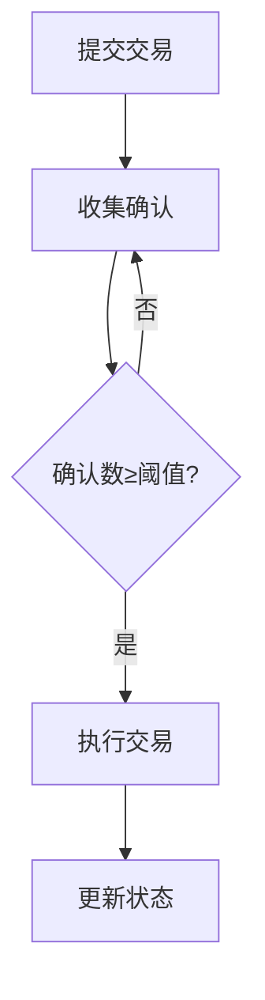

Dapp实战案例003：从零部署 2/3 多签钱包并实现前端交互

本教程将带你学习如何构建一个需要3个签名者中2人确认才能执行的智能合约钱包，涵盖以下核心内容：
- 多签钱包原理与安全机制
- Hardhat本地开发环境配置
- TypeScript智能合约开发
- Vite前端交互实现
- 钱包权限管理最佳实践

---

## 目录
1. [环境准备](#一、环境准备)
2. [开发思路](#开发思路)
3. [合约开发](#二、合约开发)
4. [本地测试](#三、本地测试)
5. [前端开发](#四、前端开发)
6. [部署上线](#五、部署上线)
7. [安全规范](#六、安全规范)

---

## 一、环境准备

### 1.1 开发环境搭建
```bash
# 创建项目目录
mkdir multi-sig-wallet && cd multi-sig-wallet

# 初始化Hardhat
npm init -y
npm install --save-dev hardhat @nomicfoundation/hardhat-toolbox
npx hardhat

# 选择 "Create a basic sample project"

# 安装依赖
npm install -D dotenv
npm install @openzeppelin/contracts
# npm install @nomicfoundation/hardhat-verify ethers @vitejs/plugin-react viem @types/react @types/node
1.2 网络配置
创建 .env 文件：

INFURA_KEY=your_infura_key
PRIVATE_KEY=your_private_key
配置 hardhat.config.ts：

```typescript
import { HardhatUserConfig } from "hardhat/config";
import { ethers } from "hardhat";

require("@nomicfoundation/hardhat-toolbox");
require("dotenv").config();

const config: HardhatUserConfig = {
  solidity: "0.8.20",
  networks: {
    sepolia: {
      url: `https://sepolia.infura.io/v3/${process.env.INFURA_KEY}`,
      accounts: [process.env.PRIVATE_KEY!]
    }
  },
  etherscan: {
    apiKey: process.env.ETHERSCAN_API_KEY
  }
};

export default config;
```


## 开发思路

本多签钱包合约采用分层架构设计，主要包含以下核心组件：

1. **所有者管理模块**
   - 初始化时设置所有者地址列表和确认阈值
   - 通过`onlyOwner`修饰器实现权限控制
   - 使用映射结构高效验证所有者身份

2. **交易生命周期管理**
   - 提交交易：生成唯一交易ID并记录交易详情
   - 确认交易：收集所有者签名，达到阈值后自动执行
   - 执行交易：通过底层call方法完成资金转移

3. **状态追踪机制**
   - 使用`nonce`防止重放攻击
   - 通过`executed`标记防止重复执行
   - 实时更新确认状态映射

### 安全考虑

1. **权限控制**
   - 所有关键操作都限制为仅所有者可调用
   - 构造函数验证所有者地址唯一性
   - 交易执行前验证确认数是否达标

2. **输入验证**
   - 检查目标地址不为零地址
   - 验证交易ID有效性
   - 防止重复确认

3. **防御机制**
   - 使用require语句进行前置条件检查
   - 交易执行后验证call操作结果
   - 通过事件日志追踪所有关键操作

### 执行流程



---

二、合约开发
2.1 核心合约代码
// contracts/MultiSigWallet.sol
// SPDX-License-Identifier: MIT
pragma solidity ^0.8.20;

// @title 2/3多签钱包合约
// @notice 需要至少2个所有者确认才能执行交易
contract MultiSigWallet {
    address[] public owners;
    uint public threshold;
    uint public nonce;
    mapping(uint => Transaction) public transactions;
    mapping(uint => mapping(address => bool)) public confirmations;

    struct Transaction {
        address to;
        uint value;
        bytes data;
        bool executed;
    }

    modifier onlyOwner() {
        require(isOwner(msg.sender), "Not authorized");
        _;
    }

    constructor(address[] memory _owners, uint _threshold) payable {
        require(_owners.length >= _threshold, "Invalid threshold");
        require(_owners.length <= 10, "Max 10 owners");
        owners = _owners;
        threshold = _threshold;
    }

    function submitTransaction(address _to, uint _value, bytes calldata _data) external onlyOwner {
        uint txId = nonce;
        transactions[txId] = Transaction({
            to: _to,
            value: _value,
            data: _data,
            executed: false
        });
        nonce++;
        emit Submission(txId);
    }

    function confirmTransaction(uint _txId) external onlyOwner {
        require(!confirmations[_txId][msg.sender], "Already confirmed");
        require(transactions[_txId].to != address(0), "Invalid transaction");
        confirmations[_txId][msg.sender] = true;
        emit Confirmation(msg.sender, _txId);
        if (isConfirmed(_txId)) {
            executeTransaction(_txId);
        }
    }

    function executeTransaction(uint _txId) internal {
        Transaction storage txn = transactions[_txId];
        require(!txn.executed, "Already executed");
        require(isConfirmed(_txId), "Insufficient confirmations");
        txn.executed = true;
        (bool success, ) = txn.to.call{value: txn.value}(txn.data);
        require(success, "Transaction failed");
        emit Execution(_txId);
    }

    function isConfirmed(uint _txId) public view returns (bool) {
        uint count = 0;
        for (uint i = 0; i < owners.length; i++) {
            if (confirmations[_txId][owners[i]]) {
                count++;
            }
        }
        return count >= threshold;
    }

    event Submission(uint txId);
    event Confirmation(address sender, uint txId);
    event Execution(uint txId);

    function isOwner(address addr) public view returns (bool) {
        for (uint i = 0; i < owners.length; i++) {
            if (owners[i] == addr) {
                return true;
            }
        }
        return false;
    }
}

三、本地测试
3.1 测试脚本
// test/MultiSigWallet.test.ts
import { expect } from "chai";
import { ethers } from "hardhat";

describe("MultiSigWallet", () => {
  let wallet: MultiSigWallet;
  let owner1: SignerWithAddress, owner2: SignerWithAddress, owner3: SignerWithAddress;

  before(async () => {
    const signers = await ethers.getSigners();
    [owner1, owner2, owner3] = signers;
    
    const Contract = await ethers.getContractFactory("MultiSigWallet");
    wallet = await Contract.deploy([owner1.address, owner2.address, owner3.address], 2);
    await wallet.waitForDeployment();
  });

  it("Should submit and execute transaction", async () => {
    // 测试用例：验证完整交易流程
    const txData = {
      to: owner1.address,
      value: ethers.parseEther("1"),
      data: "0x"
    };

    // 提交交易
    const tx = await wallet.connect(owner1).submitTransaction(
      txData.to,
      txData.value,
      txData.data
    );
    await tx.wait();

    // 确认交易
    await wallet.connect(owner2).confirmTransaction(0);
    
    // 验证执行
    const receipt = await wallet.executeTransaction(0);
    await receipt.wait();
    
    expect(await ethers.provider.getBalance(wallet.address)).to.equal(ethers.parseEther("9"));
  });
});
四、前端开发
4.1 项目初始化
# 创建React项目
npm create vite@latest multi-sig-frontend -- --template react-ts
cd multi-sig-frontend

# 安装依赖
npm install ethers @metamask/providers viem
4.2 钱包连接组件
// src/components/WalletConnector.tsx
import { useEffect, useState } from 'react';
import { ethers } from 'ethers';

export default function WalletConnector() {
  // 钱包连接状态管理
const [provider, setProvider] = useState<ethers.providers.Web3Provider | null>(null);
const [walletAddress, setWalletAddress] = useState('');

  useEffect(() => {
    if (window.ethereum) {
      const provider = new ethers.providers.Web3Provider(window.ethereum);
      setProvider(provider);
    }
  }, []);

  const connectWallet = async () => {
    if (!provider) return;
    
    try {
      await provider.send("eth_requestAccounts", []);
      const signer = provider.getSigner();
      setWalletAddress(await signer.getAddress());
    } catch (error) {
      console.error("Connection failed:", error);
    }
  };

  return (
    <div>
      {!walletAddress ? (
        <button onClick={connectWallet}>连接钱包</button>
      ) : (
        <p>已连接：{walletAddress}</p>
      )}
    </div>
  );
}
4.3 钱包交互界面
// src/components/WalletUI.tsx
import { useState } from 'react';
import { ethers } from 'ethers';

export default function WalletUI() {
  const [transactions, setTransactions] = useState([]);
  const [newTx, setNewTx] = useState({ to: '', value: '' });

  // 提交交易处理流程
const submitTransaction = async () => {
    // 前置条件检查
    if (!walletAddress || !provider) return;
    
    try {
      const signer = provider.getSigner();
      const contract = new ethers.Contract(contractAddress, contractABI, signer);
      
      const tx = await contract.submitTransaction(
        newTx.to,
        ethers.parseEther(newTx.value),
        '0x'
      );
      await tx.wait();
      
      // 刷新交易列表
      fetchTransactions();
    } catch (error) {
      console.error("提交失败:", error);
    }
  };

  return (
    <div>
      <h2>发起新交易</h2>
      <input 
        placeholder="目标地址"
        value={newTx.to}
        onChange={(e) => setNewTx({...newTx, to: e.target.value})}
      />
      <input 
        type="number"
        placeholder="金额 (ETH)"
        value={newTx.value}
        onChange={(e) => setNewTx({...newTx, value: e.target.value})}
      />
      <button onClick={submitTransaction}>提交</button>

      <h2>交易记录</h2>
      <ul>
        {transactions.map((tx) => (
          <li key={tx.id}>
            {tx.to} - {tx.value} ETH - {tx.status}
          </li>
        ))}
      </ul>
    </div>
  );
}
五、部署上线
5.1 部署脚本
// scripts/deploy.ts
import { ethers } from "hardhat";

async function main() {
  const [deployer] = await ethers.getSigners();
  
  console.log("Deploying with:", deployer.address);
  
  const Contract = await ethers.getContractFactory("MultiSigWallet");
  const wallet = await Contract.deploy(
    [deployer.address, '0x...', '0x...'], // 替换为真实地址
    2
  );
  
  await wallet.waitForDeployment();
  console.log("Deployed to:", await wallet.getAddress());
}

main().catch((error) => {
  console.error(error);
  process.exitCode = 1;
});
部署命令：

npx hardhat run scripts/deploy.ts --network sepolia
六、安全规范
6.1 关键安全措施
​​权限控制​​
modifier onlyOwner() {
    require(isOwner(msg.sender), "Not authorized");
    _;
}
​​交易验证​​
require(txn.to != address(0), "Invalid transaction");
require(!confirmations[_txId][msg.sender], "Already confirmed");
​​防重放攻击​​
uint public nonce;
transactions[txId] = Transaction({...}, nonce++);
6.2 安全建议
使用OpenZeppelin的AccessControl
添加交易超时机制
实现紧急停止功能
定期审计合约代码

## 七、开发思路

### 7.1 核心设计逻辑

本多签钱包合约采用分层架构设计，主要包含以下核心组件：

1. **所有者管理模块**
   - 初始化时设置所有者地址列表和确认阈值
   - 通过`onlyOwner`修饰器实现权限控制
   - 使用映射结构高效验证所有者身份

2. **交易生命周期管理**
   - 提交交易：生成唯一交易ID并记录交易详情
   - 确认交易：收集所有者签名，达到阈值后自动执行
   - 执行交易：通过底层call方法完成资金转移

3. **状态追踪机制**
   - 使用`nonce`防止重放攻击
   - 通过`executed`标记防止重复执行
   - 实时更新确认状态映射

### 7.2 安全考虑

1. **权限控制**
   - 所有关键操作都限制为仅所有者可调用
   - 构造函数验证所有者地址唯一性
   - 交易执行前验证确认数是否达标

2. **输入验证**
   - 检查目标地址不为零地址
   - 验证交易ID有效性
   - 防止重复确认

3. **防御机制**
   - 使用require语句进行前置条件检查
   - 交易执行后验证call操作结果
   - 通过事件日志追踪所有关键操作

### 7.3 执行流程

